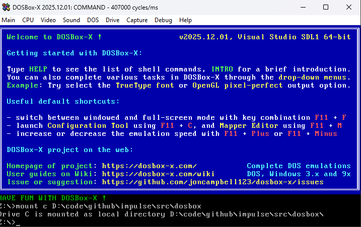
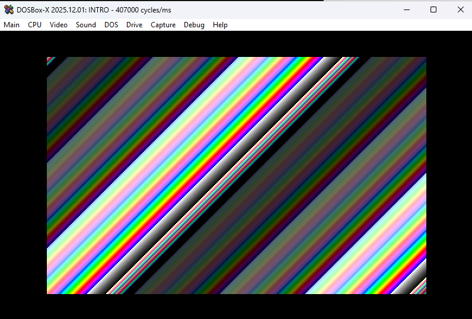
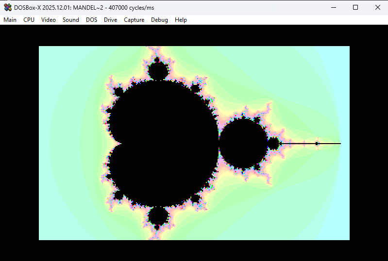

>💡 AI Transparency Disclosure: I used an AI assistant to polish up the text and code comments in this post. The code itself, and the initial, unrevised content of the blog post, were entirely written by me.

# 🎄 Coding Like It's 1984 Again 💾

**Intended audience:** Developers curious about writing compact 16-bit DOS programs

## Why?



Modern software feels bloated. Simple programs consume hundreds of megabytes. A computer with 128MiB of RAM is considered very limited, and people are impressed when Linux even runs on it.

I remember a time when my computer had 64KiB of RAM, not 64GiB. And people still managed to make cool stuff on it.

I write enterprise software by day, so I'm part of the problem. But sometimes I need to cleanse my palate and return to a time when every byte mattered.

Most of my size-coding has been 1KiB and 4KiB Windows demos, but to go below 256 bytes, I've been tinkering with 16-bit DOS programs. It's been great fun.

## The Appeal of DOS COM Files

Modern EXE files carry tons of overhead. Opening a window on Windows and initializing OpenGL is like paying a tax before you can even start. Even a "Hello World" comes with baggage.

A 16-bit DOS program (a `.COM` file) is lean and mean. Switching from text mode to Mode 13h (320×200 with 256 colors) takes just two instructions.
```asm
mov ax, 0013h  ; Set video mode 13h
int 10h        ; BIOS video interrupt
```

And like that, you're ready to push pixels!

## A Beginner Teaching Beginners

I'm by no means an expert at writing cool, compact 16-bit programs. But perhaps my beginner experience might be useful to  other beginners?

I'd like to share what I've learned as I stumbled through writing my first DOS programs, hopefully inspiring you to start coding for all the fun and zero profit.

## Controversial thoughts: Using AI as a Learning Tool

AI assistance is controversial, and for good reason. The environmental costs and ethical concerns are real and worth questioning.

But for me AI has made learning assembly more accessible.

Good DOS and x86 tutorials can be hard to find. The instruction set is arcane and weird. DOS resources are scattered across ancient forums and half-broken websites.

I don't want AI to write my programs. Where's the fun in that? But I want help with questions like:
- "What instruction should I use for this task?"
- "Is there a usable timer in DOS?"
- "How does the x87 FPU work?"

AI has been surprisingly good at answering my questions.

## Setting Up DOSBox-X

My tool of choice for running and debugging DOS programs is [DOSBox-X](https://dosbox-x.com/), a fork of the classic [DOSBox](https://www.dosbox.com/) emulator with better tooling and a built-in debugger.

### Quick Start Guide

**1. Install DOSBox-X**
- Download from [dosbox-x.com](https://dosbox-x.com/)
- Accept the default installation options

**2. Mount Your Working Folder**
- Start DOSBox-X
- Go to `Main → Configuration Tool → AUTOEXEC.BAT`
- Add this line: `mount C C:\path\to\your\project\folder`
  (Replace with your actual folder path)
- Save and restart: `Main → Restart DOSBox-X instance`

**3. Verify It Worked**
- Type `C:` to switch to your mounted drive
- Type `dir` to list files. You should see your project folder contents

**4. Bigger Video Output**
- Go to `Main → Configuration Tool → Video`
- Set output to `OpenGL perfect`
- Under `SDL` (click "Show advanced options"), set `windowresolution` to `1600x1050`

**5. More CPU Power**
- `CPU → Emulate CPU speed`: `Pentium III 866MHz`
- `CPU → CPU core`: `Normal core`
- `CPU → CPU type`: `Pentium III`

This gives you a machine that would've cost a fortune in 1999!

With DOSBox-X configured, you can edit files in your favorite editor on the host system, then immediately test in DOS.

## Installing NASM

To write programs for DOS, we need an assembler. You didn't think we'd use C, did you? That's the road to bloatware!

An assembler is a tool that converts "human-readable" assembly code into machine code that the CPU can execute.

For DOS programming, the go-to assembler is NASM (Netwide Assembler).

### Installation Steps

1. Download NASM from [nasm.us](https://www.nasm.us/)
2. Install it (accept the defaults)
3. Make sure NASM is in your system PATH so you can run it from anywhere

### Verify It Works

Open a terminal (or command prompt) and type:
```bash
nasm -v
```

You should see the NASM version number. If you get "command not found," you need to add NASM to your PATH.

### A Note About Assembly

To keep the program compact, we'll write it in assembly language.

Assembly language a very explicit, "dumb" programming language.

In assembly there are no types, everything is just bytes in memory. Some bytes happen to be executable instructions, others are data. It's up to the programmer to interpret these bytes correctly.

The x86 has 16-bit registers like `AX`, `BX`, `CX`, and `DX`. Think of them as global variables that the CPU can access instantly.

Want to add two numbers?
```asm
add ax, bx    ; ax += bx (in C notation)
```

Loading variables from memory:
```asm
mov ax, [variable_name]    ; Load value from memory into AX
add ax, [variable_name]    ; Add memory value directly to AX
```

Something like `add [x], [y]` doesn't work. You have to load one into a register first:
```asm
mov ax, [x]
add ax, [y]
mov [x], ax
```

If `AX` already contains something you need, save it to the stack first with `push ax`, then restore it later with `pop ax`.

Some registers such the `IP` (Instruction Pointer) register has special meaning in that it points to the current instruction. The CPU executes it, then increments `IP` to the next instruction.

When you `call` a function, you're really just changing `IP` to a new address (while pushing the old `IP` onto the stack, which `SP` points to, so you can return later).

As an assembly developer you have to take algorithms and break them apart into very small explicit steps which can be a chore but when the program finally works you feel a real sense of accomplishment.

### The First Program

Every NASM program for DOS needs a small prelude before the actual code:
```asm
BITS 16          ; Tell NASM we're writing 16-bit code
ORG 0x100        ; COM files start at memory offset 0x100

start:
  ; Your code goes here

  ; Return to DOS
  ret
```

`BITS 16` tells NASM we're writing 16-bit x86 code (DOS programs are 16-bit).

`ORG 0x100` sets the origin point. COM files don't have headers. They're just raw machine code loaded directly into memory at offset `0x100`. This tells NASM where the code will live so it can calculate addresses correctly.

`ret` returns control to DOS by popping the return address from the stack into `IP`.

> ⚠️ Stack Discipline Warning
> Balance your `push` and `pop` calls before `ret`, or you'll severely disappoint Bill Gates. DOS will crash, or worse, do something "fun" instead.

### Building and Running

Save this as `intro.asm` in your shared folder, then assemble it:
```bash
nasm -f bin -o intro.com intro.asm -l intro.lst
```

- `-f bin` outputs a raw binary (COM file)
- `-o intro.com` names the output file
- `-l intro.lst` creates a listing file showing the assembled code with sizes

Switch to DOSBox-X and run it:
```
intro.com
```

The program should exit immediately (since it just returns to DOS).

> 💡 The `.lst` file is great for size-coding.
> It shows exactly how many bytes each instruction takes. Useful when you're hunting for every last byte.

### Switch to VGA Mode 13h

Let's draw some simple graphics. To do so we first need to switch from text mode graphics to the classic VGA Mode 13h.

In Mode 13h the screen is 320×200 pixels, and each pixel is a single byte that indexes into a 256-color palette.

```asm
; Switch to VGA video mode 13h (320x200, 256 colors)
mov ax, 0013h

; Call BIOS Video Services via interrupt 10h
int 10h
```

That's it. Two instructions. This is what an API should look like.

`int 10h` triggers a software interrupt that calls into BIOS firmware. Think of it like calling a system function, with parameters passed through registers. In this case, `AX = 0x0013` tells the BIOS "switch to Mode 13h."

The name "Mode 13h" simply comes from the hex value `0x13` that we pass to the BIOS.

### Preparing to Fill the Screen

The `stosb` instruction is very commonly used with mode 13h. A single byte instruction that does a lot in true CISC spirit.

**What `stosb` does:**
1. Stores the value in `AL` (lower 8 bits of `AX`) to memory at `ES:DI`
2. Increments or decrements `DI` based on the direction flag (`DF`)

### The Segmented Memory Model

`ES:DI` represents x86's infamous segmented memory addressing.

The x86 is a 16-bit CPU with 16-bit registers, which can normally only address 64KiB of RAM. But DOS can use up to 640KiB. How?

**Segment:Offset addressing.** The CPU takes the segment register (`ES`), shifts it left by 4 bits, then adds the offset (`DI`). This creates a 20-bit address, allowing access to 1024KiB of memory.

For VGA Mode 13h, video memory starts at physical address `0xA0000`. So we set:
- `ES = 0xA000` (segment)
- `DI = 0` (offset)
- `0xA000 << 4 + 0x0000 = 0xA0000`

Here's the setup code:
```asm
; Prepare ES:DI to point to video memory
mov ax, 0A000h   ; VGA framebuffer segment
mov es, ax       ; Can't load ES directly, must go through AX

; Start at offset 0 (beginning of video memory)
xor di, di       ; XOR is shorter than MOV DI, 0

; Clear direction flag (DF=0 means increment DI)
cld
```

> 💡 Why `xor di, di`?
> XORing a register with itself always produces zero, and it's 2 bytes versus 3 bytes for `mov di, 0`. Size-coding classic!

### Filling the Screen with Data

Let's fill the screen with a simple pattern. Here's what we're doing in C pseudocode:
```c
char *vga = 0xA0000;
for (int y = 200; y > 0; --y) {
  for (int x = 320; x > 0; --x) {
    *vga = x + y;
    ++vga;
  }
}
```

> 💡 Looping towards zero is both faster and smaller.
> The `dec` and `jnz` (jump if not zero) combination is very common. The CPU's zero flag is automatically set by `dec`, so we don't need a separate comparison instruction.

The calculation `x + y` creates a diagonal gradient using the default VGA palette.

Here's the assembly version:
```asm
  ; Outer loop: iterate over rows (Y direction)
  mov word [y],200
y_loop:
  ; Inner loop: iterate over columns (X direction)
  mov word [x],320
x_loop:

  ; Compute the pixel color as x + y
  ; Since we count downwards, the top-left pixel starts at
  ; coordinates (320,200) and the bottom-right ends at (1,1)
  mov ax,[x]
  add ax,[y]

  ; STOSB is a string instruction with implicit operands:
  ; - Writes AL (the low byte of AX) to memory at ES:DI
  ; - Advances DI by one byte because DF is cleared
  stosb

  ; Decrement X until the entire row has been written
  dec word [x]
  ; Jump back if the result is not zero
  jnz x_loop

  ; Decrement Y until all rows have been written
  dec word [y]
  ; Jump back if the result is not zero
  jnz y_loop
```

> 💡 Variables in Assembly
> You'll notice `[x]` and `[y]`. We'll need to declare these variables in the data section.

### Waiting for a Key Before Exiting

To let the user fully appreciate our stunning diagonal gradient, wait for a keypress before switching back to text mode:

```asm
  ; Wait for a key press (this call blocks until a key is available)
  mov ah, 00h
  ; Invoke the BIOS Keyboard Services to read a key
  int 16h

  ; Restore standard text mode (80x25)
  mov ax, 0003h
  ; Invoke the BIOS Video Services to switch back to text mode
  int 10h

  ; Return control to DOS
  ret
```

Without the keypress wait, the program would flash the graphics on screen and immediately exit.

### Complete Source Code

Here's the entire program put together. When assembled, the final COM file is just 55 bytes. While small, an expert x86 size-coder can squeeze this down further using dark arts known only to the inner circle.

```asm
; Assemble with: nasm -f bin -o intro.com intro.asm -l intro.lst

  BITS 16
  ORG 0x100

start:
  ; The CPU uses general-purpose registers to store values during computation.
  ; CPU registers are named and directly accessible:
  ; - AX, BX, CX, DX: 16-bit registers for general arithmetic and data
  ; - SI, DI: Source Index and Destination Index, often used for memory operations
  ; - BP, SP: Base Pointer and Stack Pointer, used for function calls
  ; Each 16-bit register can be split into two 8-bit parts:
  ; - AX = AH (high byte) + AL (low byte)

  ; Many CPU instructions require specific registers:
  ; - mul/div use AX (and DX for larger results)
  ; - stosb writes AL to [ES:DI] and increments DI
  ; - loop uses CX as a counter
  ; - String operations like movsb use SI and DI
  ; This is why you'll see registers like CX and DI used consistently
  ; throughout this program - the instructions demand it.


  ; Switch to VGA video mode 13h (320x200, 256 colors)
  mov ax, 0013h
  ; Invoke the BIOS Video Services via interrupt 10h.
  ; An interrupt is a software entry point into firmware code.
  ; Conceptually this works like calling a system-provided routine,
  ; with parameters passed in CPU registers.
  int 10h

  ; Prepare for using STOSB to write pixels to video memory.
  ; This requires setting:
  ; - ES: segment register pointing to video memory
  ; - DI: offset into that memory
  ; - DF: direction flag (must be cleared so DI increments)

  ; Load the VGA video memory segment
  mov ax, 0A000h   ; Segment address of the VGA framebuffer
  mov es, ax       ; ES now points to video memory

  ; Clear the direction flag so string instructions move forward
  cld

  ; Clear DI so writing starts at the beginning of video memory
  xor di, di

  ; Outer loop: iterate over rows (Y direction)
  mov word [y],200
y_loop:
  ; Inner loop: iterate over columns (X direction)
  mov word [x],320
x_loop:

  ; Compute the pixel color as x + y
  ; Since we count downwards, the top-left pixel starts at
  ; coordinates (320,200) and the bottom-right ends at (1,1)
  mov ax,[x]
  add ax,[y]

  ; STOSB is a string instruction with implicit operands:
  ; - Writes AL (the low byte of AX) to memory at ES:DI
  ; - Advances DI by one byte because DF is cleared
  stosb

  ; Decrement X until the entire row has been written
  dec word [x]
  ; Jump back if the result is not zero
  jnz x_loop

  ; Decrement Y until all rows have been written
  dec word [y]
  ; Jump back if the result is not zero
  jnz y_loop

  ; Wait for a key press (this call blocks until a key is available)
  mov ah, 00h
  ; Invoke the BIOS Keyboard Services to read a key
  int 16h

  ; Restore standard text mode (80x25)
  mov ax, 0003h
  ; Invoke the BIOS Video Services to switch back to text mode
  int 10h

  ; Return control to DOS
  ret

; BSS section - variables are uninitialized at program start
; and may contain arbitrary values
section .bss
x resb 2
y resb 2
```

Assemble the program with:
```bash
nasm -f bin -o intro.com intro.asm -l intro.lst
```

If all goes well, switch to DOSBox-X and run:
```bash
intro.com
```



You should see a colorful diagonal gradient. Press any key to return to the DOS prompt. Not too bad, right?

## Debugging with DOSBox-X

One of the main reasons I prefer DOSBox-X over regular DOSBox is the built-in debugger. It's incredibly helpful when your assembly code does something "interesting" instead of what you intended.

### Starting the Debugger

Click `Debug → Start DOSBox-X Debugger` to open the debugger window.

You'll see a split view with several panels: registers, memory, disassembled code, and output. At the very bottom is a command prompt where you can type debugger commands.

### Setting a Breakpoint

Let's make the debugger stop right when our program starts. DOS programs typically load at address `074A:0100`, so we'll place a breakpoint there.

In the debugger command prompt, type:
```
bp 074A:0100
```

Then type:
```
run
```

Now run your program again:
```
intro.com
```

Execution will pause right before your first instruction. You can now step through the program one instruction at a time by pressing **F10**.

> 💡 Debugger Not Working?
> If stepping through code seems broken, DOSBox-X might be in `dynamic-core` mode. This mode is fast but incompatible with debugging. Switch to `normal-core` by clicking `CPU → CPU core → Normal core`.

### Reading the Debugger Display

As you step through:
- **Green line** = current instruction about to execute
- **Red line** = breakpoint

Type `help` in the command prompt to see other available debugger commands.

### Exiting the Debugger

To stop your program and exit the debugger, type `int 20` in the command prompt.

> ⚠️ Welcome to 1980s Computing
> Since DOS is from the 1980s, things don't always exit gracefully. If DOSBox-X becomes unresponsive, click `Main → Restart DOSBox-X instance`. If that doesn't work, just restart DOSBox-X entirely.

## Using the FPU

The x86 CPU only handles integers. While you can implement floating-point math using integer-only arithmetic, we have something better available: the x87 FPU (Floating Point Unit).

### The Stack-Based Model

The CPU uses registers (`AX`, `BX`, etc.), but the FPU uses a stack. You push floating-point values onto the stack, manipulate them there, and pop results back off.

The FPU stack has room for 8 floating-point values. Don't overflow it. Especially `dynamic-core` mode seems particularly sensitive to overflow. And remember, the debugger doesn't work in `dynamic-core`, so good luck debugging those crashes. (It took me a long while to figure that out.)

### The Mental Gymnastics

The stack model is great for compilers but makes my human brain hurt.

Say you have an important value at stack position `ST(2)`. You do some calculations and push a new value. Now that important value is at `ST(3)`. Push another? It's at `ST(4)`. The positions shift with every push and pop.

You constantly have to track: "Where is that value now?"

**Two ways to manage this:**

1. **Comment religiously** - Document the expected stack state at each step
2. **Store to memory** - Save important values to named variables, reload them later

Option 1 is more efficient but requires discipline. Option 2 costs bytes and speed but is easier to reason about.

Welcome to the joy of assembly programming!

### Mandelbrot as an Example



To demonstrate FPU usage, let's modify our program to render the classic Mandelbrot set.

For each pixel on screen, we compute a position `C` based on the center and zoom level, then iterate the equation:
```
Z = Z*Z + C
```

We repeat until either `|Z| > 2` (the magnitude of Z exceeds 2) or we hit our loop limit. The number of iterations determines the pixel color.

This equation seems simple, but `Z` and `C` are complex numbers, which creates the fractal's intricate structure.

### Complex Number Arithmetic

A complex number is a pair of two values: `Z = (x, y)` where `x` and `y` are regular floats.

**Addition** is straightforward. Add each component:
```
Z0 + Z1 = (Z0.x + Z1.x, Z0.y + Z1.y)
```

**Multiplication** is less obvious:
```
Z0 * Z1 = (Z0.x*Z1.x - Z0.y*Z1.y, Z0.x*Z1.y + Z1.x*Z0.y)
```

Since we're squaring `Z`, this simplifies to:
```
Z*Z = (Z.x*Z.x - Z.y*Z.y, 2*Z.x*Z.y)
```

So our full iteration becomes:
```
Z*Z + C = (Z.x*Z.x - Z.y*Z.y + C.x, 2*Z.x*Z.y + C.y)
```

We start with `Z = C` and iterate from there.

### The Magnitude Check

The magnitude `|Z|` is just the Pythagorean theorem:
```
|Z| = sqrt(Z.x*Z.x + Z.y*Z.y)
```

If `|Z|` is greater than 2, it is known that the series will go escape towards infinity and then that point is not in the mandelbrot set. If it's less, we are not sure yet and have to continue.

To avoid computing the square root every iteration, we check if `Z.x*Z.x + Z.y*Z.y > 4` instead.

As we need `Z.x*Z.x` and `Z.y*Z.y` for both the magnitude check and the next iteration, so we will reuse them.

### Screen to Complex Plane Mapping

Each pixel position `P = (x, y)` in screen space (1 to 320, 1 to 200) maps to a complex number `C`:
```
C = (Zoom*(P.x - 160) + Center.x, Zoom*(P.y - 100) + Center.y)
```

This centers the Mandelbrot at `Center`, and `Zoom` controls how far in or out we're looking.

### Translating Math to Assembly

Let's start by computing `C`, the complex number for the current pixel. We'll calculate `C.y` first:
```asm
  ; Start with the Y coordinate
  fild word  [y]
  ; Center Y around zero (subtract half the screen height)
  fsub dword [half_h]
  ; Scale by zoom factor
  fmul dword [zoom]
  ; Offset to center the view on the desired region
  fadd dword [center_y]
  ; Store the imaginary component of C
  fst  dword [c_y]
```

> 💡 The FPU can't use floating-point literals directly in code.
> Values like `[half_h]`, `[zoom]`, and `[center_y]` must be declared in the data section at the end of the program.

Now repeat the same process for `C.x`:
```asm
  ; Now compute the X coordinate
  fild word  [x]
  ; Center X around zero (subtract half the screen width)
  fsub dword [half_w]
  ; Scale by zoom factor
  fmul dword [zoom]
  ; Offset to center the view on the desired region
  fadd dword [center_x]
  ; Store the real component of C
  fst  dword [c_x]
```

Because of the stack-based nature of the FPU, computing `C.x` after `C.y` leaves us with both values on the stack:
```asm
  ; Current FPU stack layout:
  ; ST(0) = x (real part)
  ; ST(1) = y (imaginary part)
```

This becomes our initial value for the Mandelbrot iteration: `Z = (x, y)`.

### The main loop

We'll iterate up to 100 times to test if the point escapes. Store that limit in `CX`:
```asm
  ; Maximum iterations before considering a point "in the set"
  mov cx, 100
mandel_loop:
```

#### Computing `x*y`

We need to compute `x*x`, `y*y`, and `x*y` for the Mandelbrot iteration. I could store these intermediate values in named memory locations, but instead I'll demonstrate some stack juggling to shave off some bytes.
```asm
  ; Duplicate y into ST(0), pushing existing values down the stack
  fld st1
  ; Multiply by x to compute x*y
  ; (x is now in ST(1) due to the duplicate)
  fmul st1

  ; Stack now contains:
  ; ST(0) = x*y
  ; ST(1) = x
  ; ST(2) = y
```

That was easy, except we need to remember that pushing a new value increments all existing stack indices by 1. Hence the need to comment the stack state at regular intervals. Assembly programming builds character!

#### Computing `y*y`

Same pattern as before:
```asm
  ; Duplicate y again into ST(0)
  fld st2
  ; Square y to compute y*y
  fmul st3

  ; Stack now contains:
  ; ST(0) = y*y
  ; ST(1) = x*y
  ; ST(2) = x
  ; ST(3) = y
```

#### Computing `x*x`

The code here is identical to computing `y*y`, all the values have shifted down one step on the stack.

Sometimes this pattern can be exploited to compute multiple values in a loop, resulting in more compact code.
```asm
  ; Load x into ST(0)
  fld st2
  ; Square x to compute x*x
  fmul st3

  ; Stack now contains:
  ; ST(0) = x*x
  ; ST(1) = y*y
  ; ST(2) = x*y
  ; ST(3) = x
  ; ST(4) = y
```

#### Checking if `|Z| > 2`

Time to check one of the exit criteria: is `|Z| > 2`?

As mentioned earlier, we'll optimize this by checking `x*x + y*y > 4` instead. Avoiding the square root.

Let's compute the squared magnitude:
```asm
  ; Duplicate x*x
  fld st0
  ; Add y*y to get the magnitude squared
  fadd st2
```

Now compare this sum with 4. Load the constant `4` from the data section, then use `fcompp` to compare `ST(0)` and `ST(1)` and pop both values in just one instruction:
```asm
  ; Load the constant 4.0
  fld dword [four]
  ; Compare ST(0) with ST(1) and pop both
  fcompp
```

The FPU status flags now contain the comparison result, but we need to transfer them to the CPU to do a conditional jump. Remember, the FPU was originally a separate chip, which sometimes shines through even to this day.

**Transfer FPU flags to CPU:**
```asm
  ; Copy FPU status word to AX
  fstsw ax
  ; Copy AH into CPU flags register
  sahf
  ; Jump if below (magnitude < 4)
  jb mandel_early_exit
```

If the point escaped early, we need to clean up the stack before exiting:
```asm
mandel_early_exit:
  ; Point escaped early - clean up the FPU stack before continuing
  ; Remove intermediate values we calculated
  ; Pop x*x
  fstp st0
  ; Pop y*y
  fstp st0
  ; Pop x*y
  fstp st0

  ; Stack now contains:
  ; ST(0) = x
  ; ST(1) = y

  jmp mandel_exit
```

#### Computing the Next `Z`

If `|Z| <= 2`, the point hasn't escaped yet. We continue iterating to determine if it's in the Mandelbrot set (the black regions) or will eventually escape to infinity (the colored regions).

We need to compute `Z*Z + C`, which expands to:
```
(Z.x*Z.x - Z.y*Z.y + C.x, 2*Z.x*Z.y + C.y)
```

#### Computing the new real part:

```asm
  ; Compute the new real part: x*x - y*y + C.x
  ; Load x*x
  fld st0
  ; Subtract y*y
  fsub st2
  ; Add the real component of C
  fadd dword [c_x]
  ; Store as the new x value
  fstp st4
```

#### Clean up intermediate values:

```asm
  ; Clean up values we no longer need
  ; Pop x*x
  fstp st0
  ; Pop y*y
  fstp st0

  ; Stack now contains:
  ; ST(0) = x*y
  ; ST(1) = x
  ; ST(2) = y
```

#### Computing the new imaginary part:

```asm
  ; Compute the new imaginary part: 2*x*y + C.y
  ; Double x*y
  fadd st0
  ; Add the imaginary component of C
  fadd dword [c_y]
  ; Store as the new y value
  fstp st2

  ; Stack now contains:
  ; ST(0) = x
  ; ST(1) = y
```

#### Almost Done

The last step of the loop: decrement the loop counter `CX` by 1 and loop again if it's not zero. There's an instruction that does exactly that: `loop`.

After the loop completes (either by escaping or hitting the iteration limit), we clean up by popping the remaining values off the FPU stack.

```asm
  ; Decrement iteration counter (cx) and continue if not done
  loop mandel_loop
mandel_exit:
  ; Clean up the FPU stack to prevent overflow
  ; We need to restore the stack to its original state
  ; Pop y
  fstp st0
  ; Pop x
  fstp st0
```

### Writing the Color

Now we write a color to the VGA buffer to make the Mandelbrot visible. I'll take the easy route and use the lower byte of `CX` as the color value.

Since `CX = 0` for points that never escaped (the Mandelbrot set itself), those pixels will be black. Points that escaped early will have higher values, creating a colorful gradient around the set.
```asm
  ; Use the iteration count as the color (higher count = darker)
  ; This creates the characteristic Mandelbrot coloring
  mov ax,cx
  stosb
```

### The Complete Example


When assembled, the final program is 184 bytes. Well under the magic 256-byte limit.

```asm
; Assemble with: nasm -f bin -o mandel_brot.com mandel_brot.asm -l mandel_brot.lst

  BITS 16
  ORG 0x100

start:
  ; Switch to VGA video mode 13h (320x200 pixels, 256 colors)
  mov ax, 0013h
  int 10h

  ; Initialize the x87 floating-point unit
  finit

  ; Set up ES to point to VGA video memory
  mov ax, 0A000h   ; VGA framebuffer starts at segment 0xA000
  mov es, ax       ; ES now points to video memory

  ; Clear the direction flag so string instructions increment addresses
  cld

  ; Start writing at the beginning of video memory
  xor di, di

  ; Algorithm overview:
  ; for each pixel (x,y):
  ;   C = convert pixel to complex coordinate
  ;   Z = C
  ;   for iteration = 0 to MAX_ITERATIONS:
  ;     Z = Z*Z + C
  ;     if |Z| > 2: break
  ;   color = iteration count

  ; Outer loop: iterate over rows (Y direction)
  mov word [y],200
y_loop:
  ; Inner loop: iterate over columns (X direction)
  mov word [x],320
x_loop:

  ; The Mandelbrot set uses the iterative formula: Z = Z*Z + C
  ; where both Z and C are complex numbers, and C is the pixel coordinate

  ; We use the FPU (Floating Point Unit) for these calculations.
  ; Unlike CPU registers (AX, BX, CX), the FPU is stack-based with 8 slots
  ; named ST(0), ST(1), etc. Most FPU instructions operate on ST(0), the top
  ; of the stack. When you push a new value, everything shifts down one slot,
  ; which can be tricky to track.
  ; To simplify FPU code, you can store intermediate results in memory,
  ; but this increases both code size and execution time.

  ; FPU store operations have two modes:
  ; - fst: store value and leave it on the stack
  ; - fstp: store value and pop it off the stack
  ; Special case: "fstp st0" pops the top element without storing anywhere

  ; Convert pixel coordinates (x, y) to the complex number C

  ; Start with the Y coordinate
  fild word  [y]
  ; Center Y around zero (subtract half the screen height)
  fsub dword [half_h]
  ; Scale by zoom factor
  fmul dword [zoom]
  ; Offset to center the view on the desired region
  fadd dword [center_y]
  ; Store the imaginary component of C
  fst  dword [c_y]

  ; ST(0) now contains the imaginary part of C

  ; Now compute the X coordinate
  fild word  [x]
  ; Center X around zero (subtract half the screen width)
  fsub dword [half_w]
  ; Scale by zoom factor
  fmul dword [zoom]
  ; Offset to center the view on the desired region
  fadd dword [center_x]
  ; Store the real component of C
  fst  dword [c_x]

  ; ST(0) now contains the real part of C
  ; The imaginary part is now in ST(1) due to the stack structure

  ; Current FPU stack layout:
  ; ST(0) = x (real part)
  ; ST(1) = y (imaginary part)

  ; Maximum iterations before considering a point "in the set"
  mov cx, 100
mandel_loop:
  ; Duplicate y into ST(0), pushing existing values down the stack
  fld st1
  ; Multiply by x to compute x*y
  ; (x is now in ST(1) due to the duplicate)
  fmul st1

  ; Stack now contains:
  ; ST(0) = x*y
  ; ST(1) = x
  ; ST(2) = y

  ; Duplicate y again into ST(0)
  fld st2
  ; Square y to compute y*y
  fmul st3

  ; Stack now contains:
  ; ST(0) = y*y
  ; ST(1) = x*y
  ; ST(2) = x
  ; ST(3) = y

  ; Load x into ST(0)
  fld st2
  ; Square x to compute x*x
  fmul st3

  ; Stack now contains:
  ; ST(0) = x*x
  ; ST(1) = y*y
  ; ST(2) = x*y
  ; ST(3) = x
  ; ST(4) = y

  ; Check if Z has escaped (magnitude > 2)
  ; Normally: sqrt(x*x + y*y) > 2
  ; To avoid the square root, we compare x*x + y*y > 4 instead

  ; Duplicate x*x
  fld st0
  ; Add y*y to get the magnitude squared
  fadd st2

  ; Check if we've escaped (magnitude squared >= 4)

  ; Push 4.0 onto the FPU stack
  fld dword [_4]
  ; Compare ST(0) with ST(1), then pop both values
  ; This compares 4.0 with (x*x + y*y)
  fcompp
  ; Copy FPU status flags to AX register
  ; (The FPU has its own flags separate from the CPU flags)
  fstsw ax
  ; Copy AH into the CPU's flag register
  ; This makes the FPU comparison result available to CPU jump instructions
  sahf
  ; Jump if below: if (x*x + y*y) < 4.0, the point has escaped
  jb mandel_early_exit

  ; Point hasn't escaped yet, continue iterating
  ; Apply the Mandelbrot formula: Z = Z*Z + C
  ; For complex numbers, if Z = (x, y):
  ; Z*Z = (x*x - y*y, 2*x*y)
  ; Then we add C

  ; Compute the new real part: x*x - y*y + C.x
  ; Load x*x
  fld st0
  ; Subtract y*y
  fsub st2
  ; Add the real component of C
  fadd dword [c_x]
  ; Store as the new x value
  fstp st4

  ; Clean up values we no longer need
  ; Pop x*x
  fstp st0
  ; Pop y*y
  fstp st0

  ; Stack now contains:
  ; ST(0) = x*y
  ; ST(1) = x
  ; ST(2) = y

  ; Compute the new imaginary part: 2*x*y + C.y
  ; Double x*y
  fadd st0
  ; Add the imaginary component of C
  fadd dword [c_y]
  ; Store as the new y value
  fstp st2

  ; Stack now contains:
  ; ST(0) = x
  ; ST(1) = y

  ; Decrement iteration counter (cx) and continue if not done
  loop mandel_loop
mandel_exit:
  ; Clean up the FPU stack to prevent overflow
  ; We need to restore the stack to its original state
  ; Pop y
  fstp st0
  ; Pop x
  fstp st0

  ; Use the iteration count as the color (higher count = darker)
  ; This creates the characteristic Mandelbrot coloring
  mov ax,cx
  stosb

  ; Move to the next pixel in the current row
  dec word [x]
  ; Continue until the entire row is complete
  jnz x_loop

  ; Move to the next row
  dec word [y]
  ; Continue until all rows are complete
  jnz y_loop

  ; Wait for a keypress before exiting
  mov ah, 00h
  int 16h

  ; Return to text mode (80x25 characters)
  mov ax, 0003h
  int 10h

  ; Exit program and return to DOS
  ret
mandel_early_exit:
  ; Point escaped early - clean up the FPU stack before continuing
  ; Remove intermediate values we calculated
  ; Pop x*x
  fstp st0
  ; Pop y*y
  fstp st0
  ; Pop x*y
  fstp st0

  ; Stack now contains:
  ; ST(0) = x
  ; ST(1) = y

  jmp mandel_exit

; DATA section

; Constant value 4.0 for escape radius comparison
_4        dd  4.0
; Center point of the Mandelbrot view
center_x  dd  -0.5
center_y  dd  0.0
; Zoom level (smaller = more zoomed in)
zoom      dd  0.01

; Half of the screen dimensions (for centering calculations)
half_w    dd  160.0
half_h    dd  100.0

; BSS section - uninitialized variables
; These will contain arbitrary values at program start
section .bss
x   resb 2
y   resb 2
c_x resb 4
c_y resb 4
```

## Minimizing Even Further

I won't claim to be an expert at writing tiny DOS programs, but I love tinkering to see what I can squeeze into 256 bytes. After a week of shipping enterprise bloatware, we all need a little bit of mental flossing.

A real size-coding expert would doubtless find multiple ways to shrink my examples even more. Some of the ways I could think are:

**Assume DOS initialization.** I've been a good programmer and explicitly initialized registers and memory. But if you're willing to assume what DOS initializes for you, those bytes can be saved. Risky? Sure but nobody remembers a 257 bytes demo, need to hit that 256 byte limit at any cost.

**Pure stack-based FPU code.** Keep everything on the FPU stack instead of storing and loading constants from memory. Saves bytes at the cost of your sanity. The price of progress.

**Hunt for shorter instructions.** Many x86 instructions have multiple encodings. Sometimes an instruction that does almost what you need is shorter than the "correct" one. Creative reuse of registers and flags can save precious bytes.

**Blur the line between code and data.** Remember, there's no real distinction in assembly land. Sometimes your data is executable code, or vice versa. This gets weird fast, but can be extremely compact.

If you want to see the experts at work, check out the size-coding productions on platforms like Pouët or DemoZoo. They've turned byte-shaving into an art form. [Lovebyte](https://demozoo.org/parties/5201/) competition has lots of examples.

## Merry Christmas to All!

DOS programming is a strange mix of constraint and freedom. You're working with an ancient operating system and arcane memory models, but there's no framework telling you how to structure your code, no package manager dependency hell, no waiting for webpack to bundle. Just you, the CPU, and 640KiB of RAM.

Write a simple program that fills the screen with a pattern, and watch it run. There is satisfaction of seeing your code render pixels when you know *exactly* what every instruction is doing.

You'll make no money from writing code like it's 1984 again but might you remember why you fell in love with programming in the first place. The joy of making the machine do something cool with just a few bytes of cleverly arranged instructions.

Go out there and make something tiny and wonderful.

🫶 [mrange](https://www.shadertoy.com/user/mrange) 🫶


